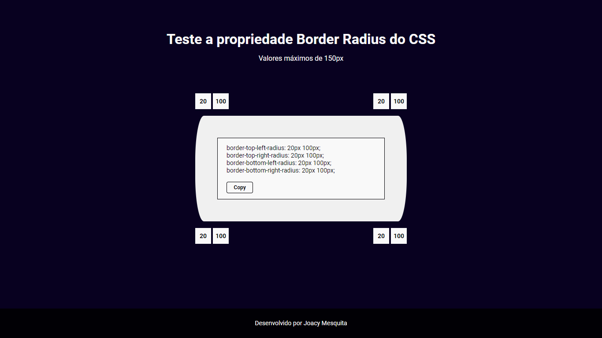

<h1>
    

        Border-radius Previewer
    

     
</h1>

 

    <a href="#tecnologias">Tecnologias</a>
    &nbsp;&nbsp;&nbsp;|&nbsp;&nbsp;&nbsp;
    <a href="#projeto">Projeto</a>

 
 

    

<h2 title='#tecnologias'>
    Tecnologias
</h2>

Esse projeto foi desenvolvido com as seguintes tecnologias:

- Html5
- Css3
- Javascript

<h2 title='#projeto'>
    Projeto
</h2>

Implementação de um ambiente de teste para a propriedade Border-radius do Css